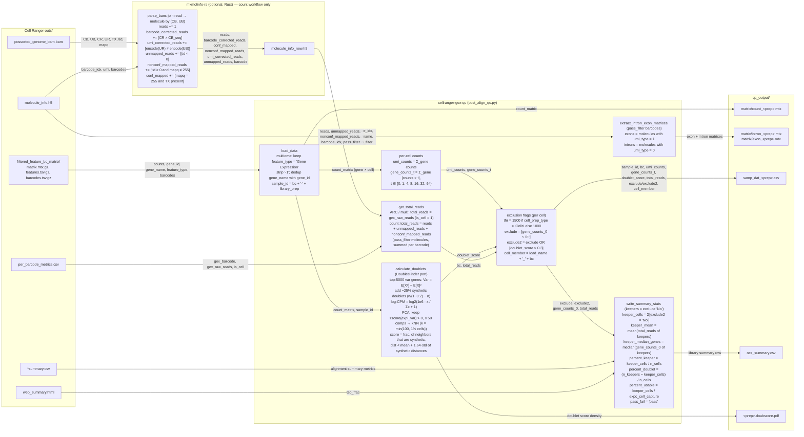
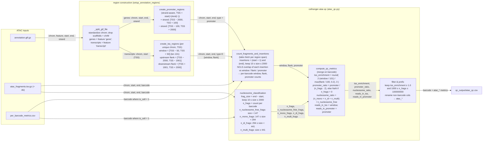

# cellranger-qc

[](https://github.com/beagan-svg/cellranger-qc/actions/workflows/ci.yml)
[](https://www.python.org/)
[](https://docs.astral.sh/uv/)

Post-run quality-control tools for Cell Ranger GEX, multiome, and ATAC outputs.

This repository provides:

- `cellranger-gex-qc`: GEX/multiome post-alignment QC, doublet scores, intron/exon matrices, count matrices, and library summaries.
- `cellranger-atac-qc`: portable ATAC QC from fragments, per-barcode metrics, and a GTF annotation.
- Optional Rust helper for generating `molecule_info_new.h5` files used by GEX QC workflows.

## Requirements

- Python 3.12
- [`uv`](https://docs.astral.sh/uv/) for Python environment management
- Cell Ranger output files for the workflow you are running
- Rust stable only if you build the optional `molecule_info_new.h5` helper

This project is intentionally pinned to Python 3.12 to keep the scientific Python dependency stack consistent across local development and CI.

## Setup

Install dependencies (runtime plus dev tooling) from the lockfile:

```bash
uv sync --frozen
```

For a runtime-only install (no test or lint tools):

```bash
uv sync --frozen --no-dev
```

The interpreter is pinned to Python 3.12 via `.python-version` and `requires-python`, so no `--python` flag is needed.

Check the installed commands:

```bash
uv run cellranger-gex-qc --help
uv run cellranger-atac-qc --help
```

## GEX / Multiome QC

### Pipeline



### Diagram walkthrough

The GEX/multiome workflow starts from the Cell Ranger alignment outputs under `outs/`. Each file contributes a specific slice of data:

- `filtered_feature_bc_matrix/` — the cell-filtered count matrix (`matrix.mtx.gz`) with its row labels (`features.tsv.gz`: gene id, gene name, feature type) and column labels (`barcodes.tsv.gz`). This is the gene × cell expression matrix.
- `molecule_info.h5` — per-molecule records (`barcode_idx`, `feature_idx`, `umi_type`, `barcode_info/pass_filter`) used to split molecules into introns vs exons.
- `per_barcode_metrics.csv` — present for ARC/multi runs; supplies `gex_raw_reads` and the `is_cell` flag.
- `*summary.csv` and `web_summary.html` — library-level alignment metrics and the TSO fraction.
- `possorted_genome_bam.bam` — consumed only by the optional Rust helper.

#### mkmolinfo-rs metrics (count workflow only)

`cellranger count` does not emit the per-molecule read breakdown that downstream QC relies on, so the optional Rust helper `mkmolinfo` rebuilds it. It streams `possorted_genome_bam.bam`, joins each read to a molecule by its (corrected barcode `CB`, corrected UMI `UB`) pair, keeps only molecules present in `molecule_info.h5`, and accumulates these counters before writing them into `molecule_info_new.h5`:

- **reads** — total BAM records that join to the molecule. Formula: `reads += 1` for every read sharing the molecule's `(CB, UB)`. This is the raw sequencing support behind each molecule and the basis for every downstream read total.
- **barcode_corrected_reads** — reads whose barcode was repaired during correction. Formula: `+= 1` when the raw `CR` tag differs from the `CB` sequence (GEM suffix stripped). It tells us how often a barcode had to be error-corrected, a signal of barcode/sequencing quality.
- **conf_mapped** — confidently, uniquely mapped reads. Formula: `+= 1` when `tid ≥ 0` and `mapq == 255` and a transcriptome-compatible `TX` tag is present. It tells us the usable transcriptomic signal — reads that can be trusted to a single gene.
- **nonconf_mapped_reads** — mapped but not confidently. Formula: `+= 1` when `tid ≥ 0` and `mapq ≠ 255`. It tells us how many alignments were ambiguous or multi-mapped.
- **umi_corrected_reads** — reads whose UMI was repaired. Formula: `+= 1` when `encode(UR) ≠ encode(UB)`. It tells us the UMI error rate.
- **unmapped_reads** — reads that did not align. Formula: `+= 1` when `tid < 0`. It tells us the share of sequencing that produced no alignment.

A seventh dataset, `barcode`, stores the 2-bit encoding of the cell barcode used to key the molecules.

#### Per-cell metrics (samp_dat)

`load_data` reads the filtered matrix (keeping only `Gene Expression` features for multiome), strips the `-1` GEM suffix, disambiguates duplicate gene names with the gene id, and forms `sample_id = bc-library_prep`. From there `get_cell_samp_dat` builds the per-cell table:

- **umi_counts** — total UMIs per cell. Formula: column sum of the gene × cell matrix. It tells us the sequencing depth captured for each cell.
- **gene_counts_t** — number of genes expressed above each threshold, `t ∈ {0, 1, 4, 8, 16, 32, 64}`. Formula: `Σ_gene [counts > t]`. `gene_counts_0` is the number of detected genes; higher thresholds describe how much signal comes from well-expressed genes. It tells us transcriptional complexity, the primary cell-quality signal.
- **doublet_score** — likelihood the barcode captured two cells. Computed by the DoubletFinder port: synthesize ~25% artificial doublets (`n/(1−0.2) − n`) by summing random cell pairs, log-CPM normalize (`log2(1e6·x/Σx + 1)`), embed with PCA (components with `zscore(explained_variance) > 0`, capped at 50), then score each real cell by the fraction of its `k` nearest neighbors (`k = min(100, 1% of cells)`) that are artificial within `mean + 1.64·std` of the artificial-neighbor distances. It tells us which barcodes are likely multiplets.
- **total_reads** — total reads for the cell, from `get_total_reads`. For ARC/multi: `gex_raw_reads`; for count: `reads + unmapped_reads + nonconf_mapped_reads` summed over the cell's pass-filter molecules. It tells us the total sequencing effort per cell, including reads that never reached the count matrix.
- **exclude / exclude2** — QC gates. `exclude = [gene_counts_0 < thr]` with `thr = 1500` for `Cells` and `1000` otherwise; `exclude2 = exclude OR [doublet_score > 0.3]`. They tell us, respectively, whether a cell fails on complexity alone and whether it fails on complexity or doubletness.
- **cell_member** — `load_name + "_" + bc`. The cross-modality join key linking the GEX and ATAC halves of a multiome library.

#### Intron / exon matrices

`extract_intron_exon_matrices` splits pass-filter molecules from `molecule_info.h5` by `umi_type` (`1` = exon, `0` = intron) into two feature × cell matrices. The intron fraction distinguishes nuclear/pre-mRNA content and supports RNA-velocity and nuclei-prep QC.

#### Library-level summary (ocs_summary.csv)

Keepers are cells with `exclude == "No"`; the doublet-clean subset has `exclude2 == "No"`. `write_summary_stats` then aggregates:

- **keeper_cells** — `Σ [exclude2 == "No"]`. The count of high-quality, non-doublet cells.
- **keeper_mean** — mean `total_reads` over keepers. Average sequencing depth of good cells.
- **keeper_median_genes** — median `gene_counts_0` over keepers. Typical gene complexity of good cells.
- **percent_keeper** — `keeper_cells / n_cells`. Share of barcodes that pass.
- **percent_doublet** — `(n_keepers − keeper_cells) / n_cells`. Share lost to the doublet gate.
- **percent_usable** — `keeper_cells / expc_cell_capture`. Yield against the expected cell load (can exceed 1).
- **tso_frac** — parsed from `web_summary.html`. Template-switch-oligo fraction, a chemistry QC signal.
- **pass_fail** — always `"pass"`; failing libraries are flagged by manual inspection downstream.

Run:

```bash
uv run cellranger-gex-qc \
  --libs libs.csv \
  --out-dir qc_output \
  --num-cores 16
```

### Library Manifest

`--libs` is a CSV with one row per library.

| Column | Description |
| --- | --- |
| `cellranger_run_dir` | Cell Ranger run directory containing the `outs` folder |
| `library_prep` | Library prep name used in sample IDs and output names |
| `cell_prep_type` | `Cells` uses a 1,500 gene threshold; other values use 1,000 |
| `load_name` | Prefix used to create `cell_member` |
| `alignment_method` | Used to identify Cell Ranger ARC/multi outputs |
| `expc_cell_capture` | Expected cell capture count for usable-cell percentage |

### Expected Inputs

For each manifest row, the workflow expects these files under the resolved Cell Ranger `outs` directory:

- `filtered_feature_bc_matrix/matrix.mtx.gz`
- `filtered_feature_bc_matrix/features.tsv.gz`
- `filtered_feature_bc_matrix/barcodes.tsv.gz`
- `*molecule_info.h5`
- `*summary.csv`
- `web_summary.html`
- Either `per_barcode_metrics.csv` or `*molecule_info_new.h5`

### Outputs

The GEX/multiome workflow writes:

- `matrix/count_<library_prep>.mtx`
- `matrix/intron_<library_prep>.mtx`
- `matrix/exon_<library_prep>.mtx`
- `samp_dat_<library_prep>.csv`
- `<library_prep>.doubscore.pdf`
- `ocs_summary.csv`

## ATAC QC

### Pipeline



### Diagram walkthrough

ATAC QC consumes three alignment outputs: the GTF annotation (`annotation.gtf.gz`), the fragment file (`atac_fragments.tsv.gz` with its `.tbi` tabix index, columns `chrom, start, end, barcode`), and `per_barcode_metrics.csv` (used for the `is_cell` filter). A fragment's two endpoints are Tn5 insertion sites — the unit of accessibility signal counted here.

#### Region construction

`_split_gtf_file` standardizes chromosome names, drops scaffolds and chrM, and separates `gene` and `transcript` features. Two region sets are derived:

- **TSS window / flanks** (`create_tss_regions`, per unique TSS): a 101 bp window centered on the TSS (`[TSS−50, TSS+50]`) plus two 100 bp background flanks at `[TSS−2000, TSS−1901]` and `[TSS+1901, TSS+2000]`. The window captures accessibility signal; the flanks estimate background.
- **Promoters** (`create_promoter_regions`, strand-aware): `[TSS−2000, TSS+100]` on the `+` strand and `[TSS−100, TSS+2000]` on the `−` strand, where TSS is the gene `start` (`+`) or `end` (`−`).

#### Fragment-derived metrics

Fragments are filtered to `10 ≤ frag_size ≤ 2000`, where `frag_size = end − start`. `nucleosome_classification` then counts, per barcode:

- **n_frags** — total kept fragments for the cell. It tells us per-cell library depth and feeds the keeper filter.
- **n_nucleosome_free_frags** — fragments with `frag_size < 147` (shorter than one nucleosome). The open-chromatin signal.
- **n_mono_frags** — `147 ≤ frag_size < 294` (about one nucleosome).
- **n_di_frags** — `294 ≤ frag_size < 441` (about two nucleosomes).
- **n_multi_frags** — `frag_size ≥ 441` (three or more nucleosomes).

`count_fragments_and_insertions` takes each fragment's insertions at `start + 1` and `end`, and uses an NCLS interval index to assign each insertion to a window, flank, or promoter region, producing per-barcode **window**, **flank**, and **promoter** counts.

#### QC metrics (compute_qc_metrics)

The nucleosome counts and insertion counts are merged on `barcode`, then:

- **tss_enrichment** — signal-to-noise of accessibility at TSSs. Formula: `round( 2·(window/101) / max(flank/100, 0.2), 3 )` — window read density over background flank density, with a `0.2` floor to avoid dividing by near-zero. It is the primary ATAC cell-quality metric.
- **promoter_ratio** — fraction of insertions landing in promoters. Formula: `promoter / (n_frags · 2)` (×2 because each fragment has two endpoints), `NaN` when `n_frags = 0`. It tells us how promoter-focused a cell's accessibility is.
- **nucleosome_ratio** — nucleosomal vs nucleosome-free balance. Formula: `(n_mono_frags + n_di_frags + n_multi_frags) / n_nucleosome_free_frags`. It tells us whether the fragment-size distribution shows the expected nucleosome banding.
- **reads_in_tss / reads_in_promoter** — the raw `window` and `promoter` insertion counts, retained for reporting.

#### Filtering and output

Cells are kept when `tss_enrichment ≥ 1.0` and `1000 ≤ n_frags ≤ 100000000`. Every column except `barcode` is then prefixed `atac_` and written to `atac_qc.csv`.

Run:

```bash
uv run cellranger-atac-qc \
  --output-path qc_output \
  --annotation-file genes.gtf.gz \
  --atac-fragments-path fragments.tsv.gz \
  --per-barcode-metrics-path per_barcode_metrics.csv
```

### Expected Inputs

- `--annotation-file`: GTF annotation file, optionally gzipped
- `--atac-fragments-path`: bgzip-compressed, tabix-indexed Cell Ranger ATAC `fragments.tsv.gz`
- `--per-barcode-metrics-path`: Cell Ranger `per_barcode_metrics.csv`
- `--output-path`: directory where `atac_qc.csv` will be written

The fragments file must have a sibling tabix index, usually `fragments.tsv.gz.tbi`.

### Outputs

The ATAC workflow writes `atac_qc.csv` with passing cells and `atac_`-prefixed metrics, including:

- `atac_tss_enrichment`
- `atac_reads_in_tss`
- `atac_n_frags`
- `atac_n_nucleosome_free_frags`
- `atac_n_mono_frags`
- `atac_n_di_frags`
- `atac_n_multi_frags`
- `atac_nucleosome_ratio`
- `atac_reads_in_promoter`
- `atac_promoter_ratio`

## Optional molecule_info_new.h5 Helper

The Rust helper generates `molecule_info_new.h5` from a Cell Ranger output directory. Build it only if your GEX workflow needs that compatibility file.

```bash
cargo build --manifest-path mkmolinfo-rs/Cargo.toml --release
```

See the [helper documentation](docs/mkmolinfo.md) for usage, HDF5 version notes, and validation-test details.

## Operational Notes

- Commands log progress to standard output with timestamps and step summaries.
- GEX doublet scoring uses a deterministic random seed.
- ATAC insertion counting parallelizes chromosome batches internally.
- Large fragment files should live on fast local or high-throughput shared storage.
- Generated matrices, HDF5 files, CSVs, PDFs, Rust build outputs, and local environments are ignored by git.

## Development

Run Python checks:

```bash
uv sync --frozen
uv run ruff check .
uv run pytest
```

Or use Makefile shortcuts:

```bash
make check
```

Run Rust checks if the optional `molecule_info_new.h5` helper changed:

```bash
make rust-check
```

GitHub Actions runs Python linting/tests on Python 3.12, plus Rust formatting/tests for the optional helper.

## Versioning

This project uses semantic versioning:

- `MAJOR`: incompatible CLI, input, or output changes
- `MINOR`: backward-compatible features
- `PATCH`: backward-compatible fixes and documentation updates

Release checklist:

1. Update `version` in `pyproject.toml`.
2. Update `__version__` in `src/cellranger_qc/__init__.py`.
3. Add a new section to `CHANGELOG.md`.
4. Commit and tag the release:

```bash
git add pyproject.toml src/cellranger_qc/__init__.py CHANGELOG.md
git commit -m "Release v0.1.0"
git tag v0.1.0
git push origin main --tags
```
